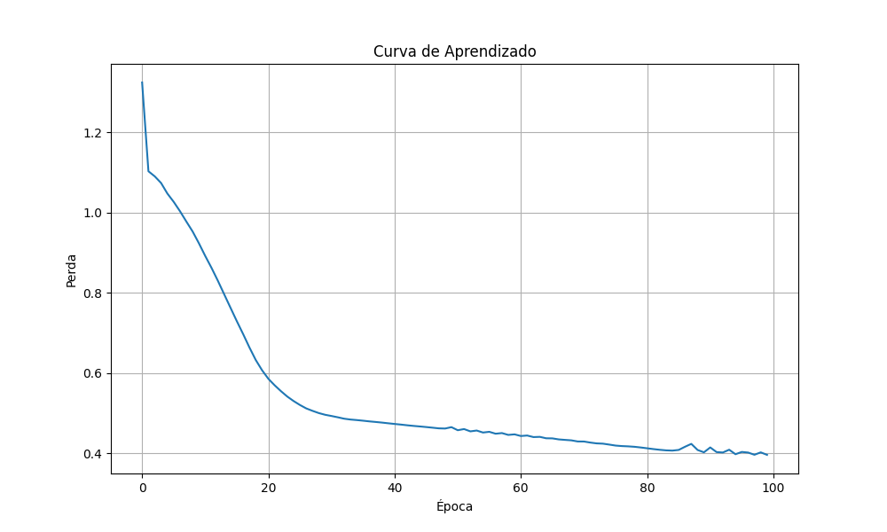

# Estudo de Classificação com PyTorch e Visualização com Seaborn

Este projeto é um estudo de classificação usando uma rede neural simples implementada com PyTorch. O conjunto de dados utilizado é o famoso conjunto de dados Iris. Além disso, o projeto inclui visualizações de dados e fronteiras de decisão usando Seaborn e Matplotlib.

## Descrição

O objetivo deste projeto é treinar uma rede neural simples para classificar as amostras do conjunto de dados Iris. O projeto inclui:

- Criação de um conjunto de dados Iris.
- Definição e treinamento de uma rede neural simples.
- Avaliação do modelo.
- Visualização da fronteira de decisão em 2D e 3D.
- Previsão para novos dados.

## Instalação

1. Clone o repositório:
    ```sh
    git clone https://github.com/rochinh-a/pytorch-seaborn-visualization
    cd seu-repositorio
    ```

2. Crie um ambiente virtual e ative-o:
    ```sh
    python -m venv venv
    source venv/bin/activate  # No Windows use `venv\Scripts\activate`
    ```

3. Instale as dependências:
    ```sh
    pip install -r requirements.txt
    ```

## Uso

1. Execute o script:
    ```sh
    python pytorchtest2.py
    ```

2. O script irá:
    - Carregar o conjunto de dados Iris.
    - Treinar uma rede neural simples.
    - Avaliar o modelo no conjunto de teste.
    - Plotar a curva de aprendizado.
    - Plotar a fronteira de decisão em 3D.
    - Fazer uma previsão para um novo dado.

## Estrutura do Código

### `pytorchtest2.py`

Este arquivo contém todo o código necessário para realizar o estudo de classificação. Ele inclui funções para:

- **Definir a seed**: `set_seed`
- **Criar o conjunto de dados**: `create_dataset`
- **Definir a rede neural**: `SimpleNeuralNetwork`
- **Treinar o modelo**: `train_model`
- **Plotar os resultados do treinamento**: `plot_training_results`
- **Avaliar o modelo**: `evaluate_model`
- **Plotar a fronteira de decisão em 2D**: `plot_decision_boundary`
- **Plotar a fronteira de decisão em 3D**: `plot_decision_boundary_3d`
- **Fazer previsões**: `make_prediction`
- **Função principal**: `main`

## Visualizações

### Curva de Aprendizado



### Fronteira de Decisão 3D


## Contribuição

Contribuições são bem-vindas! Sinta-se à vontade para abrir uma issue ou enviar um pull request.

## Licença

Este projeto está licenciado sob a Licença MIT. Veja o arquivo [LICENSE](LICENSE) para mais detalhes.

---

Feito com ❤️ por [Mateus](https://github.com/rochinh-a)
